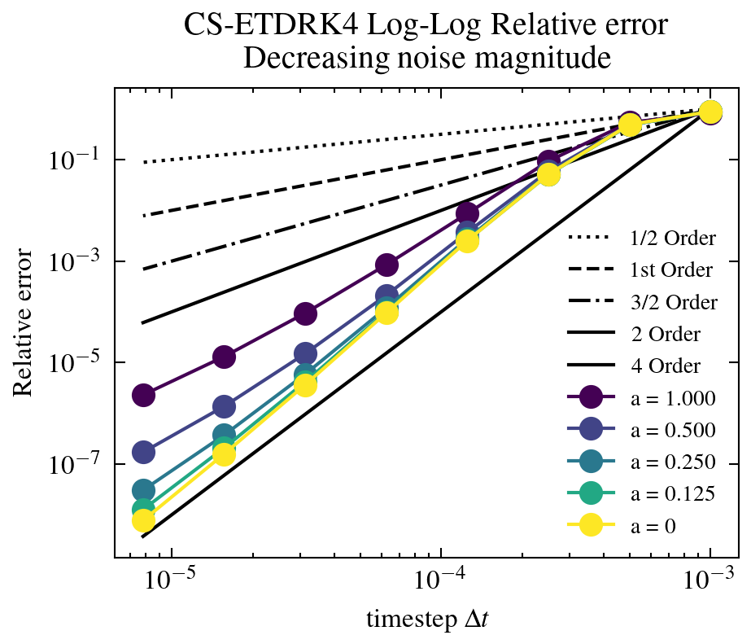

# ETD Data Assimilation

[🏠 Back to Overview](README.md)

### Example 1: KS + KdV Equations
In [Example_1_KdV.ipynb](examples/Example_1_KdV.ipynb) we demonstrate running the deterministic KdV equation using initial conditions and model parameters from [models/ETD_ETD_KT_CM_JAX_Vectorised.py](models/ETD_KT_CM_JAX_Vectorised.py). One can create a new dictionary, and run under different initial conditions, timestep and model parameters. For instance, in [Example_1_KS.ipynb](examples/Example_1_KS.ipynb) we demonstate running the Deterministic Kuramoto-Sivashinsky equation under the sensitive initial conditions specified in Kassam and Trefethen (stored in [models/ETD_ETD_KT_CM_JAX_Vectorised.py](models/ETD_KT_CM_JAX_Vectorised.py)). 
| KdV   | KS  |
| ------------- | ------------- |
|   |  |
### Example 2: 

In [Example_2_KS_perturbed.ipynb](examples/Example_2_KS_perturbed.ipynb) and [Example_2_KdV_perturbed.ipynb](examples/Example_2_KdV_perturbed.ipynb). We run deterministic Kuramoto-Sivashinsky and deterministic KdV equations under small random initial condition pertubations of magnitude $10^{-8}$, and compute the change in relative L2 error.

$$
\begin{align}
\frac{||u_1 - u_2||_{2}}{||u_2||_{2}}
\end{align}
$$

We observe initial condition sensitivities of magnitudes $10^{8}$ and $10^{1}$ respectively. KDV has linear growth, whilst the KS has exponential growth.

| KdV   | KS  |
| ------------- | ------------- |
|   |  |
| Log-log | Log log  |
|   |  |

### Example 3: 
In these two notebooks: We demonstrate how to run a particle filter with the stochastic KS and KdV equation under transport noise. We include subsampled data in both space and time. 

These notebooks indicate a qualitive difference between the ability of the bootstrap particle filter to converge between the KdV equation and the KS equation. The particle filter does not converge to the KS equation and converges to the KdV, in the context of the twin experiment, where data is generated by the forward model. 

This is interesting in light of the Low dimensional behaviour of the KS equation, and the fact that the PF filter typically fails due to dimensionality of the state space being a challenge. The results in this example indicating that the equations sensitivity to initial condition and stochastic pertubation makes the KS more challenging. 

### Example 3a:
In this notebook we demonstrate how to use the 'ParticleFilterAll' class to run a particle filter and output the full trajectories, including the timepoints in between assimilation times. 

### Example 4: 

### Example 5: 
These notebooks demonstrate temporal and spatial convergence using a pathwise stochastic travelling wave solution to the KdV equation under constant noise. 
| Travelling Wave- Space time plot |
---------------------

Convergence - plots
| Spatial convergence  | Temporal convergence |
| ------------- | ------------- |
|   |  |

Example_5_KdV_Temporal_Convergence_dW_refined_Limit_of_small_noise.ipynb

contains temporal convergence in the limit of vanishing noise, showing strong order 2 (for commutative noise) becoming strong order 4. This experiment indicates benifit to capturing higher order deterministic term. 

Convergence - plots
| Temporal convergence  | Temporal convergence |
| ------------- | ------------- |
|   |  |

Example_5_KDV_Temporal_Convergence_dW_refined.ipybn, also compares the exponential time differencing approach CSETDRK44, with a stochastic integrating factor method SIFRK44. Showing in this case the SETD scheme can be run at much larger timestep, and have much lower error. 

### Example 6: 
These notebooks visualise the deterministic solution, for the KdV and KS equation. 

| KS-waterfall | KdV-waterfall |
| ------------- | ------------- |
|   |   |
| KS-spacetime | KdV-spacetime |
| |  |

### Example 7: 
These notebooks visualise the effect of ensemble size on the KS and KDV equation, under the standard bootstrap particle filter.

We see that the Particle filter diverges in the case of KS and does not recover in the case of increasing the ensemble size. In the case of KdV increasing the ensemble size does decrease the error. 

### Example 8:
Example 8 shows a soliton-soliton interaction, and a basic setup for a neural network. 

### Example 9: 
Example 9 shows the use of the ensemble Kalman filter. 