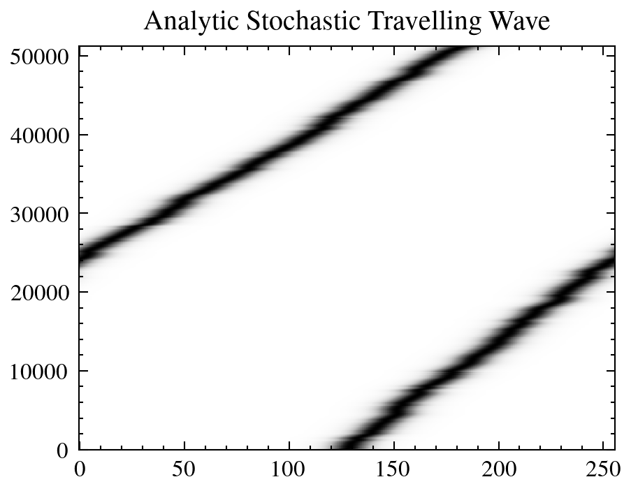
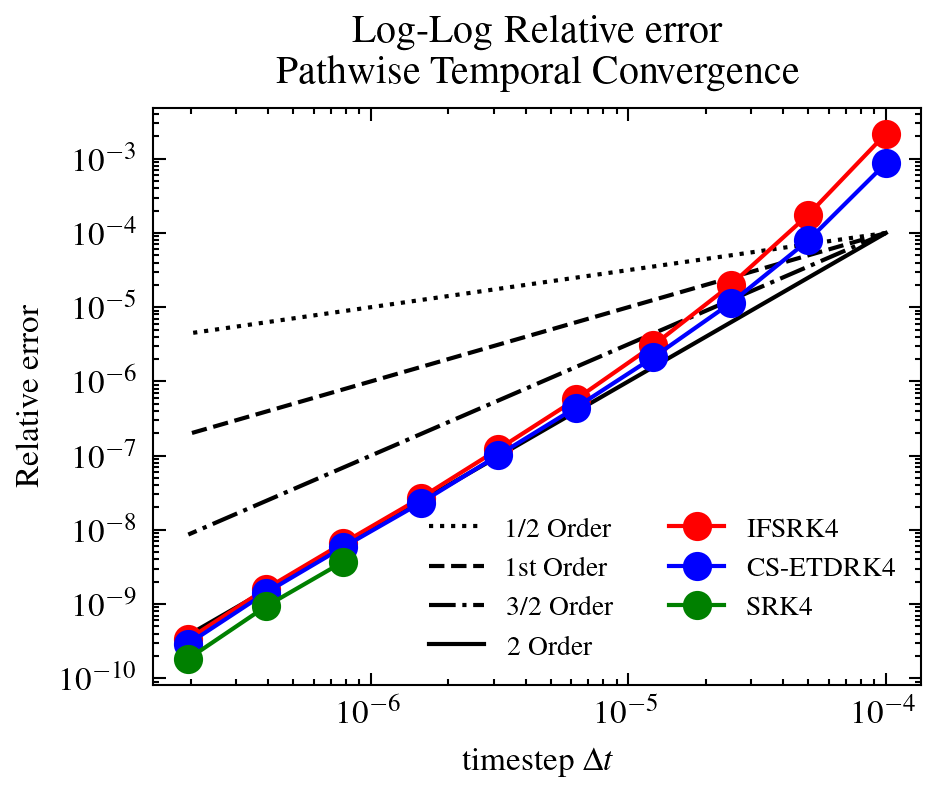

# ETD Data Assimilation

[🏠 Back to Overview](README.md)

---
---

### Example 1: KS + KdV Equations
In [Example_1_KdV.ipynb](examples/Example_1_KdV.ipynb) we demonstrate running one member $E=1$ of a deterministic KdV equation 
$$\begin{align}
u_t + uu_x + \gamma u_{xxx} = 0,
\end{align}$$
with dispersive parameter $\gamma = 2.0e-05$
over the periodic unit interval $x\in[0,1]$, 
with timestep
$\Delta t= 0.001$, for the 
gaussian initial condition 
$u_0(x) = \exp(-\frac{(x - 0.5)^2}{0.02})$. We use a ($2/3$-rds dealiased) fast fourier transform spectral method in space using the ETDRK4 of Cox and Mathews $(2002)$ with the Kassam and Trefethen 2005 contour integration technique. We use
$n_x= 256$ spatial points and use 
$n_t= 4000$ timesteps, until the final time of $t_{max}= 4$ is reached.

These initial conditions and model parameters are stored in [models/ETD_ETD_KT_CM_JAX_Vectorised.py](models/ETD_KT_CM_JAX_Vectorised.py). One can create a new dictionary, and run under different initial conditions, timestep and model parameters. For instance, in [Example_1_KS.ipynb](examples/Example_1_KS.ipynb) we demonstate running the Deterministic Kuramoto-Sivashinsky equation 
$$\begin{align}
u_t + uu_x + u_{xx} + u_{xxxx} = 0,
\end{align}$$
under the initial conditions specified in Kassam and Trefethen (stored in [models/ETD_ETD_KT_CM_JAX_Vectorised.py](models/ETD_KT_CM_JAX_Vectorised.py)). 

### Results of example one
| KdV   | KS  |
| ------------- | ------------- |
|   |  |

---
---

### Example 2: 

In [Example_2_KS_perturbed.ipynb](examples/Example_2_KS_perturbed.ipynb) and [Example_2_KdV_perturbed.ipynb](examples/Example_2_KdV_perturbed.ipynb). We run deterministic Kuramoto-Sivashinsky and deterministic KdV equations under small random initial condition pertubations of magnitude $10^{-8}$, and compute the change in relative L2 error.

$$
\begin{align}
\frac{||u_1 - u_2||_{2}}{||u_2||_{2}}
\end{align}
$$

We observe initial condition sensitivities of magnitudes $10^{8}$ and $10^{1}$ respectively. KDV has linear growth, whilst the KS has exponential growth.

| KdV   | KS  |
| ------------- | ------------- |
|   |  |
| Log-log | Log log  |
|   |  |

### Example 3: 
In [Example_3_KdV_ensemble.ipynb](examples/Example_3_KdV_ensemble.ipynb) and [Example_3_KS_ensemble.ipynb](examples/Example_3_KS_ensemble.ipynb). We demonstrate how to run a particle filter with the stochastic KS and KdV equation under transport noise. We include subsampled data in both space and time under linear but noisy and sparse observations. 

In [Example_3_KdV_ensemble.ipynb](examples/Example_3_KdV_ensemble.ipynb) we use a class which employs resampling when data is available. Whereas in [Example_3_KS_ensemble.ipynb](examples/Example_3_KS_ensemble.ipynb) we use a class which resamples conditionally according to a ESS threshold (set to 1.1 as to ensure resampling occurs each time data is available in this example) resampling and uses conditional updates of the weights.

These notebooks indicate a qualitive difference between the ability of the bootstrap particle filter to converge between the KdV equation and the KS equation. The particle filter does not converge to the KS equation (in [Example_3_KS_ensemble.ipynb](examples/Example_3_KS_ensemble.ipynb)) and converges to the KdV in [Example_3_KdV_ensemble.ipynb](examples/Example_3_KdV_ensemble.ipynb), in the context of the twin experiment, where data is generated by the forward model. 

This is interesting in light of the Low dimensional behaviour of the KS equation, and the fact that the PF filter typically fails due to dimensionality of the state space being a challenge. The results indicate that the equations sensitivity to stochastic pertubation (rather than state dimension) makes the KS equation more challenging than the KdV equation. 

| KdV   | KS  |
| ------------- | ------------- |
|   |  |
| RMSE:KDV | RMSE:KS  |
|   |  |
| CRPS:KDV | CRPS:KS  |
|   |  |

### Example 3a:
In theses notebook we demonstrate how to use the 'ParticleFilterAll' class to run a particle filter and output the full trajectories, including the timepoints in between assimilation times. Away from observation times, the RMSE and CRPS of the KDV ensemble increases. The RMSE and CRPS of the KS ensemble fail to be bounded near the observation noise of $\sigma = 0.1$.

| KdV   | KS  |
| ------------- | ------------- |
| RMSE:KDV | RMSE:KS  |
|   |  |
| CRPS:KDV | CRPS:KS  |
|   |  |
### Example 4: 
In [Example_4_KdV_resampling.ipynb](examples/Example_4_KdV_resampling.ipynb) we demonstrate using either systematic resampling or multinomial resampling in context of the KdV equation under transport noise. Near identical behaviour is observed, and both filters have CRPS and RMSE scores near the observation noise. 

#### Kdv Results: 
| RMSE: KdV | CRPS: KdV |
| ------------- | ------------- |
|  |  |

---
---
---

### Example 5: 
These series of notebooks demonstrate temporal and spatial convergence using a pathwise stochastic travelling wave solution to the KdV equation under constant noise. 

In [Example_5_KdV_main_Temporal_Convergence.ipynb](examples/Example_5_KdV_main_Temporal_Convergence)

We define a sequence of refined Brownian paths, used to drive the solution of the stochastic KdV equation under constant advective noise at different temporal resolutions.

| Travelling Wave- Space time plot |
---------------------

The numerical approximations at several temporal resolutions are compared (In terms of the relative L2 error) to the analytic solution, over the entire space time interval. 
This is used to produce the following convergence plot:
| Convergence |
---------------------

Demonstrating CS-ETDRK4 attains second order for commutative noise, and can take timesteps at least 128 times larger than RK4, and in some instances having better accuracy to the IFSRK4. 

In [Example_5_KDV_SpatialConvergence.ipynb](examples/Example_5_KDV_SpatialConvergence) typical spectral convergence is established in space, (exponentially decreasing error). This was constructed slightly pathalogically, as the timestep taken required to not be dominated by temporal error was very small, and a very steep soliton solution was constructed as to mitigate the fact that solitons are not periodic boundary condition supporting solutions and can lead to discontinuity in derivatives.

| Spatial convergence   |
| ------------- |
|   |

In [Example_5_KdV_Temporal_Convergence_Limit_of_small_noise.ipynb](examples/Example_5_KdV_Temporal_Convergence_Limit_of_small_noise.ipynb), 
We consider the same experiment (as in [Example_5_KdV_main_Temporal_Convergence.ipynb](examples/Example_5_KdV_main_Temporal_Convergence)) but consider noises of decreasing magnitudes $\xi = 1,1/2,1/4,1/8$, and we observe the predicted fourth order convergence in the limit of vanishing noise. We also test convergence at a larger range of timesteps than previously tested up to $\Delta t = 1e^{-3}$, and find that at large timesteps $\Delta t$, we observe $4$-th order behaviour in the CSETDRK method. We note stability at larger timesteps.

Convergence - plots
| Temporal convergence  | Temporal convergence |
| ------------- | ------------- |
|   |  |

This experiment indicates practical benifit to capturing higher order deterministic term. 

In [Example_5_KdV_Temporal_Convergence_ALL_schemes.ipynb](examples/Example_5_KdV_Temporal_Convergence_ALL_schemes.ipynb),

We compute the final time relative L2 error on a shorter time window, but compare a much larger variety of temporal integration schemes including at larger timesteps. 

| Second order methods  | Third order methods |
| ------------- | ------------- |
|   |  |

| Fourth order methods | Total |
| ------------- | ------------- |
|   |  |

### Example 6: 
[Example_6_KdV_high_low_plots.ipynb](examples/Example_6_KdV_high_low_plots.ipynb)
[Example_6_KS_high_low_plots.ipynb](examples/Example_6_KS_high_low_plots.ipynb)
[Example_6a_KdV_high_low_plots_stochastic.ipynb](examples/Example_6a_KdV_high_low_plots_stochastic.ipynb)
[Example_6a_KS_high_low_plots_stochastic.ipynb](examples/Example_6a_KS_high_low_plots_stochastic.ipynb)

These notebooks visualise the deterministic solution, for the KdV and KS equation, at high resolution. In addition to the stochastically peturbed version.
| KS-waterfall | KdV-waterfall |
| ------------- | ------------- |
|   |   |
| KS-waterfall-stochastic | KdV-waterfall-stochastic |
|   |   |

| KS-waterfall | KdV-waterfall |
| ------------- | ------------- |
|   |   |
| KS-spacetime | KdV-spacetime |
| |  |
| KS-spacetime-stochastic | KdV-spacetime-stochastic |
| |  |

### Example 7: 
These notebooks visualise the effect of ensemble size on the KS and KDV equation, under the standard bootstrap particle filter.

We see that the Particle filter diverges in the case of KS and does not recover in the case of increasing the ensemble size. In the case of KdV increasing the ensemble size does decrease the error. 

### Example 8:
Example 8 shows a soliton-soliton interaction, and a basic setup for a neural network. 

### Example 9: 
Example 9 shows the use of the ensemble Kalman filter. 