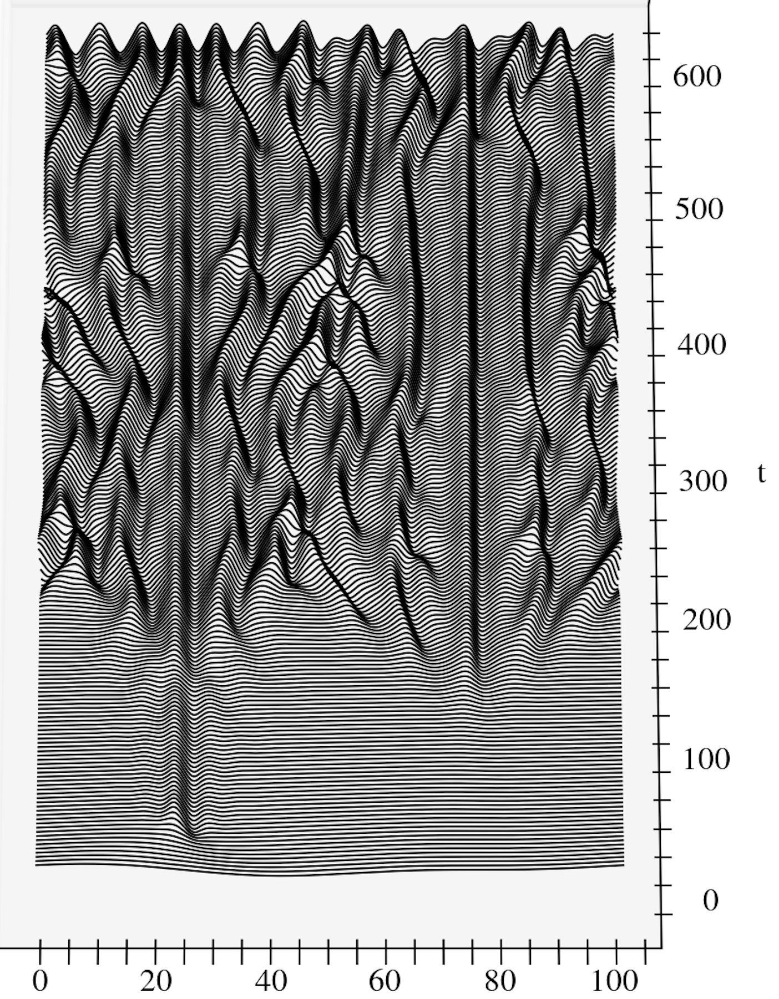
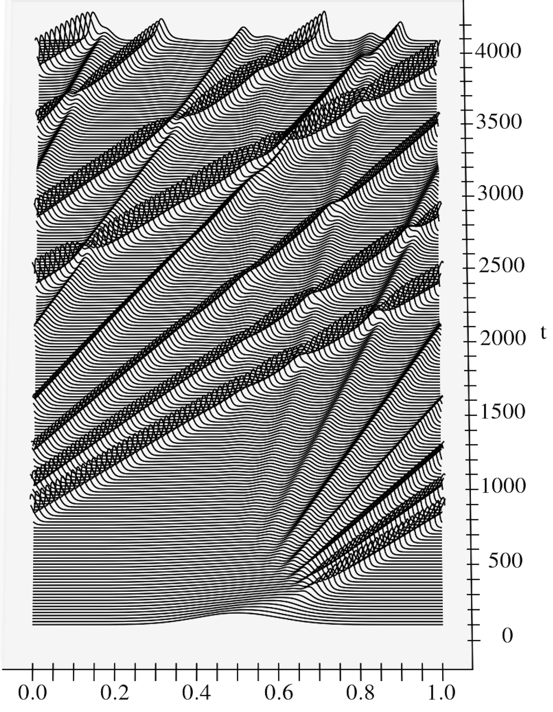
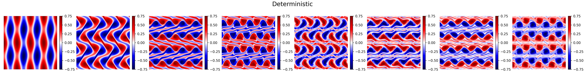
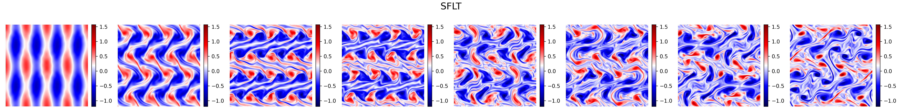

# ETD Data Assimilation

A sandbox for exploring (stochastic)**Exponential Time Differencing (ETD)** and **Stochastic Integrating Factor (SIF)** methods in the context of **data assimilation** using **particle filters** and **Kalman filters**.

This repository serves as a flexible platform for testing time-stepping schemes, stochastic integration strategies, and data assimilation algorithms.

| KS-waterfall | KdV-waterfall |
| ------------- | ------------- |
|   |   |


|Stochastic Navier-Stokes|




## [📘 See Detailed Examples →](EXAMPLES.md)


- [Example 3](EXAMPLES.md#example-3): particle filter for the KdV and KS


---

## ✨ Features
- 🧠 Autodifferentiable via JAX — supports gradient-based optimization and learning
- ⚙️**GPU and CPU compatible** — tested on NVIDIA GPUs and standard CPUs
- 🌐 Spectral spatial discretisation
- ⏱️ Timestepping: 
  - **Runge-Kutta(RK) and Stochastic Runge-Kutta**
  - **Exponential time differencing (ETDRK) and Stochastic  (ETDRK)**
  - **Integrating Factor Runge Kutta(IFRK) and Stochastic (IFRK)**

- 📈  Data Assimilation:
  - **Particle Filters (PF)**
    - Bootstrap, 
    - Resampling: Systematic resampling, multinomial resampling, and default
    - Conditional resampling on ESS
  - **Ensemble Kalman Filter(EnKF)**
    - Stochastic ENKF: Localisation () Covariance inflation

- 🔧 Tools for:
  - Abstract class for development of filtering algorithms 
  - Synthetic data generation
  - Convergence testing
  - Visualization of ensemble trajectories and filter performance
  - Configurations for reproducible experiments


## 📁 Repository Structure

```bash
etd-data-assimilation/
├── filters/ #Particle & Kalman filtering modules 
│   ├── filter.py # particle and Kalman filtering for ETD_KT_CM_JAX_Vectorised.py
│   ├── filter_2D.py # ENKF, ETKF for 2d model CGLE.py
│   └── resampling.py # some resampling algorithms for pf. 
├── models/ # forward and ensemble models 
│  ├── ETD_KT_CM_JAX_Vectorised.py # Dynamical systems (e.g. KS, KdV, SPDEs)
│  ├── NS.py # Stochastic Navier stokes equation
│  ├── QG.py # Stochastic quasi-geostrophic equation
│  ├── S_MHD.py # Stochastic magneto-hydrodynamics (2D incompressible).
│  └── CGLE.py # Complex valued Ginzburg Landau equation
├── tests/             # unit tests
├── Saving/            # Images from examples
├── metrics/
│   └──forecasting metrics 
├── examples/ 
│   └──.ipybn      # examples of usage
└── README.md          # You're here! Overview of examples
```


examples/

[📘 See Detailed Examples →](EXAMPLES.md)
